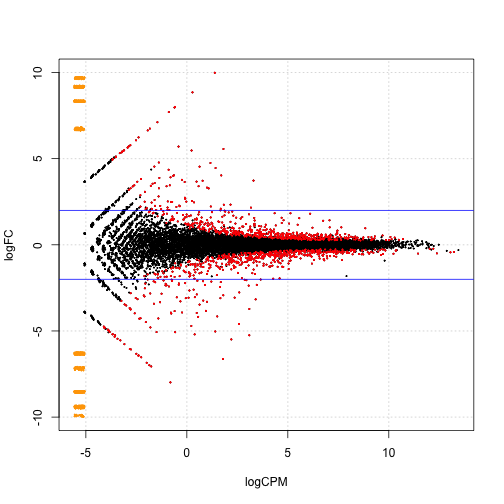

# STAT 540 Seminar 7
### RNA-seq Differential Expression Analysis
Author: Shannon Erdelyi  
Date: Feb 27, 2014

---


### Preliminaries

```r
# libraries
library(edgeR)
library(DESeq)
library(limma)

# data
dat <- read.table("data/bottomly_count_table.tsv", header = T, row.names = 1)
des <- read.table("data/bottomly_phenodata.tsv", header = T, row.names = 1)
str(dat)
str(des)
```


### Mini exercise with `edgeR`
Redo the above analysis but first filter the data and remove any gene that has   
1. count equal to zero across all samples    
2. count equal to zero in at least one sample in each genotype group   


#### (1) Filter genes with count equal to zero across all samples


```r
# filter genes
keepGenes <- apply(dat, 1, sum) != 0
dat1 <- dat[keepGenes, ]

# create an object storing the data and design information (sample) sample
# data only contains grouping by strain
dge <- DGEList(counts = dat1, group = as.numeric(des$strain))

# design matrix
dm <- model.matrix(~group, dge$samples)

# dispersion
comDisp <- estimateGLMCommonDisp(dge, dm, verbose = T)
```

```
## Disp = 0.03893 , BCV = 0.1973
```

```r
trendDisp <- estimateGLMTrendedDisp(comDisp)
tagDisp <- estimateGLMTagwiseDisp(trendDisp, dm)  ## EBayes

# plot the tagwise dispersion against log2-CPM (counts per million)
plotBCV(tagDisp)
```

 

```r

# fit glm
fit <- glmFit(tagDisp, dm)
lrt <- glmLRT(fit, coef = grep("group", colnames(coef(fit))))
groupTags <- topTags(lrt, n = Inf)

# genes with FDR < 0.01
nrow(groupTags$table[groupTags$table$FDR < 0.01, ])
```

```
## [1] 696
```

```r

# interesting genes
coolGenes <- rownames(groupTags$table[groupTags$table$FDR < 1e-50, ])
heatmap(cpm(tagDisp)[coolGenes, ], Rowv = NA, Colv = NA, margins = c(10, 10))
```

 

```r

# direction of differential expression
de <- decideTestsDGE(lrt, p = 0.05, adjust = "BH")
table(de)
```

```
## de
##    -1     0     1 
##   591 12762   579
```

```r

# plotting the tagwise log fold changes against log-cpm
tags <- rownames(tagDisp)[abs(de) == 1]
plotSmear(lrt, de.tags = tags)
abline(h = c(-2, 2), col = "blue")
```

 


#### (2) Filter genes with count equal to zero in at least one sample in each genotype group   


```r
# filter genes
keepGenes <- !(apply(dat[, des$strain == "C57BL/6J"], 1, function(x) sum(x == 
    0)) > 0 & apply(dat[, des$strain == "DBA/2J"], 1, function(x) sum(x == 0)) > 
    0)

dat2 <- dat[keepGenes, ]

# create an object storing the data and design information (sample) sample
# data only contains grouping by strain
dge <- DGEList(counts = dat2, group = as.numeric(des$strain))

# design matrix
dm <- model.matrix(~group, dge$samples)

# dispersion
comDisp <- estimateGLMCommonDisp(dge, dm, verbose = T)
```

```
## Disp = 0.0383 , BCV = 0.1957
```

```r
trendDisp <- estimateGLMTrendedDisp(comDisp)
tagDisp <- estimateGLMTagwiseDisp(trendDisp, dm)  ## EBayes

# plot the tagwise dispersion against log2-CPM (counts per million)
plotBCV(tagDisp)
```

 

```r

# fit glm
fit <- glmFit(tagDisp, dm)
lrt <- glmLRT(fit, coef = grep("group", colnames(coef(fit))))
groupTags <- topTags(lrt, n = Inf)

# genes with FDR < 0.01
nrow(groupTags$table[groupTags$table$FDR < 0.01, ])
```

```
## [1] 669
```

```r

# interesting genes
coolGenes <- rownames(groupTags$table[groupTags$table$FDR < 1e-50, ])
heatmap(cpm(tagDisp)[coolGenes, ], Rowv = NA, Colv = NA, margins = c(10, 10))
```

 

```r

# direction of differential expression
de <- decideTestsDGE(lrt, p = 0.05, adjust = "BH")
table(de)
```

```
## de
##   -1    0    1 
##  553 8854  566
```

```r

# plotting the tagwise log fold changes against log-cpm
tags <- rownames(tagDisp)[abs(de) == 1]
plotSmear(lrt, de.tags = tags)
abline(h = c(-2, 2), col = "blue")
```

 


### Take Home Problem

Choose a specific threshold for the adjusted p value, find the genes identified as differentially expressed using each of edgeR, DESeq and voom+limma. Compare the number of genes in these 3 lists, and draw a venn digram demonstrating the overlap (if any!).


```r
pThresh <- 1e-10
```


#### `edgeR`


```r
# samples and counts
dge <- DGEList(counts = dat, group = as.numeric(des$strain))

# design matrix
dm <- model.matrix(~group, dge$samples)

# dispersion
comDisp <- estimateGLMCommonDisp(dge, dm, verbose = T)
```

```
## Disp = 0.03893 , BCV = 0.1973
```

```r
trendDisp <- estimateGLMTrendedDisp(comDisp)
tagDisp <- estimateGLMTagwiseDisp(trendDisp, dm)

# fit
fit <- glmFit(tagDisp, dm)
lrt <- glmLRT(fit, coef = grep("group", colnames(coef(fit))))
groupTags <- topTags(lrt, n = Inf)

# differentially expressed genes with FDR < pThresh
deEdge <- groupTags$table[groupTags$table$FDR < pThresh, ]
```


`edgeR` found 105 differentially expressed genes. 

#### `DESeq`


```r
# data
seqDat <- newCountDataSet(dat, des$strain)
seqDat <- estimateSizeFactors(seqDat)
seqDat <- estimateDispersions(seqDat)

# fit
seqResults <- nbinomTest(seqDat, levels(des$strain)[1], levels(des$strain)[2])

# differentially expressed genes with FDR < pThresh
deSeq <- na.omit(seqResults[seqResults$padj < pThresh, ])
```


`DESeq` found 76 differentially expressed genes. 


#### `voom + limma`


```r
# data
norm.factor <- calcNormFactors(dat)
dat.voomed <- voom(dat, dm, lib.size = colSums(dat) * norm.factor)

# fit
fit <- lmFit(dat.voomed, dm)
fit <- eBayes(fit)
voomResults <- topTable(fit, coef = "group2", n = Inf)

# differentially expressed genes with FDR < pThresh
deVoom <- voomResults[voomResults$adj.P.Val < pThresh, ]
```


`voom + limma` found 18 differentially expressed genes. 

#### Compare methods


```r
# differential expression matrix
deMat <- matrix(c(as.numeric(rownames(dat) %in% rownames(deEdge)), as.numeric(rownames(dat) %in% 
    deSeq$id), as.numeric(rownames(dat) %in% deVoom$ID)), nrow = nrow(dat), 
    ncol = 3)
colnames(deMat) <- c("edgeR", "DESeq", "voom + limma")
vennDiagram(vennCounts(deMat))
```

 


