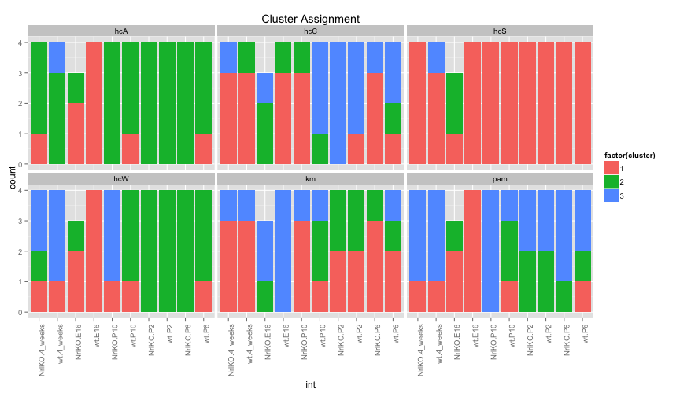
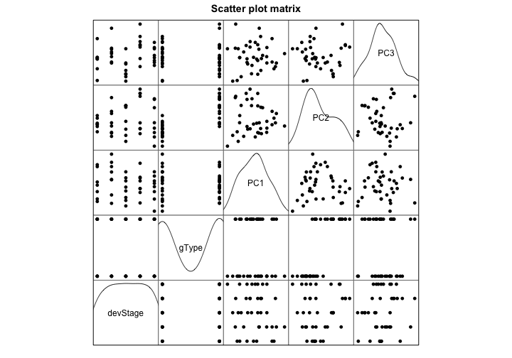
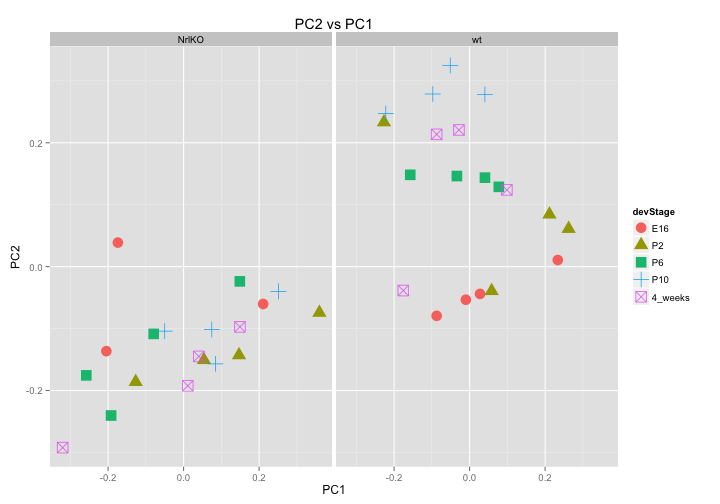

# STAT 540: Seminar 9
# Clustering and PrinciPAL Component Analysis

#### Shannon Erdelyi
#### 13-Mar-2014

--------------------------------------------


## Preparation


```r
# libraries
library(RColorBrewer)
library(cluster)
library(ggplot2)
library(lattice)
library(hexbin)
```

```
## Loading required package: grid
```

```r

# data
dir <- "/Users/shannonerdelyi/Dropbox/UBC/W2014/STAT 540"
dat <- read.table(paste(dir, "/Data/GSE4051_data.tsv", sep=""),
                  header=T, row.names=1)
des <- read.table(paste(dir, "/Data/GSE4051_design.tsv", sep=""), header=T)

# scale data
sDat <- t(scale(t(dat)))

# create interaction term
des$int <- with(des, interaction(gType, devStage))

# reorder devStage
des$devStage <- with(des, factor(devStage, 
                               levels=c("E16", "P2", "P6", "P10", "4_weeks")))
```


## Sample Clustering

### Exercise

> For a common choice of k, compare the clustering across different methods, e.g. hierarchical (pruned to specific k, obviously), k-means, PAM. You will re-discover the "label switching problem" for yourself. How does that manifest itself? How concordant are the clusterings for different methods?

Suppose $k=3$.

#### Hierarchical


```r
# clusters
k <- 3

# distance
ed <- dist(t(sDat), method="euclidean")

# clustering
hcS <- hclust(ed, method = 'single')
hcC <- hclust(ed, method = 'complete')
hcA <- hclust(ed, method = 'average')
hcW <- hclust(ed, method = 'ward')

# get cluster assignment
clusters <- data.frame(des,
           hcS=cutree(hcS, k=k),
           hcC=cutree(hcC, k=k),
           hcA=cutree(hcA, k=k),
           hcW=cutree(hcW, k=k))
```


#### k-means


```r
set.seed(8)
km <- kmeans(t(sDat), centers=k, nstart=50)
clusters$km <- km$cluster
```


#### PAM


```r
pam <- pam(ed, k=k)
clusters$pam <- pam$clustering
```


#### Compare Methods

```r
# reshape cluster data
long <- reshape(clusters, timevar="method", v.names="cluster", 
        varying=c("hcS", "hcC", "hcA", "hcW", "km", "pam"),
        times=c("hcS", "hcC", "hcA", "hcW", "km", "pam"),
        direction="long")

# plot cluster assignments
ggplot(long) +
  aes(int) +
  geom_bar(aes(fill=factor(cluster))) +
  facet_wrap(~method) +
  ggtitle("Cluster Assignment") +
  theme(axis.text.x=element_text(angle=90, hjust=1))
```

 


Note that in the figure above, colours represent cluster assignment but do not reflect similarily across methods. We are more interested in patterns of colours than the colours themselves. For instance, cluster assignment is very similar for hierarchical clustering using the average and ward linkages even though the colours are quite different. In general, developmental stage seems to be more important for cluster assignment than genotype. 

## Principal Component Analysis

### Exercise

> Most of the plots in this Seminar were done with basic R graphics. As an exercise, you can try to create new plots using lattice and/or ggplot2!


```r
# pca
pca <- prcomp(sDat, center=F, scale=F) 
pc <- cbind(des, pca$rotation[des$sidNum, ]) 

# scatter plot showing us how the first few PCs relate to covariates
scatter <- pc[ ,c("devStage", "gType", "PC1", "PC2", "PC3")]
scatter$devStage <- as.numeric(scatter$devStage)
scatter$gType <- as.numeric(scatter$gType)
splom(scatter, 
      pch=16, col=1,
      pscale=0,
      xlab=NULL,
      main="Scatter plot matrix",
      diag.panel=function(x, ...){
        yLim <- current.panel.limits()$ylim
        d <- density(x, na.rm=TRUE)
        d$y <- with(d, yLim[1]+0.95*diff(yLim)*y/max(y))
        panel.lines(d, col=1)
        diag.panel.splom(x, ...)
        })
```

 

```r

# plot data on first two PCs, colored by development stage
ggplot(pc) +
  aes(PC1, PC2, colour=devStage, shape=devStage) +
  geom_point(size=5) +
  ggtitle("PC2 vs PC1") +
  facet_wrap(~gType)
```

 


